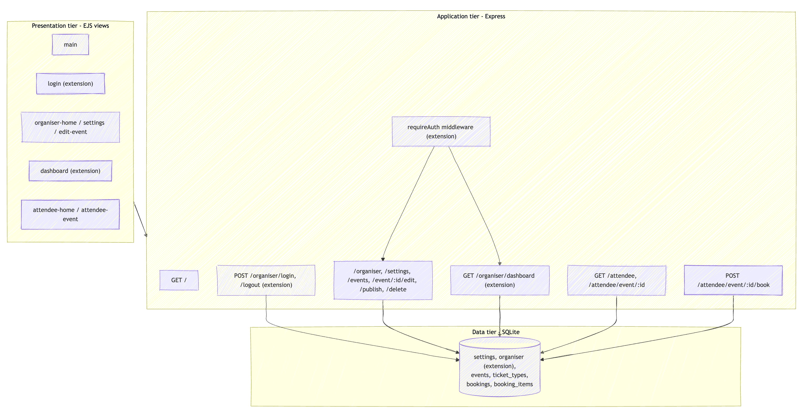
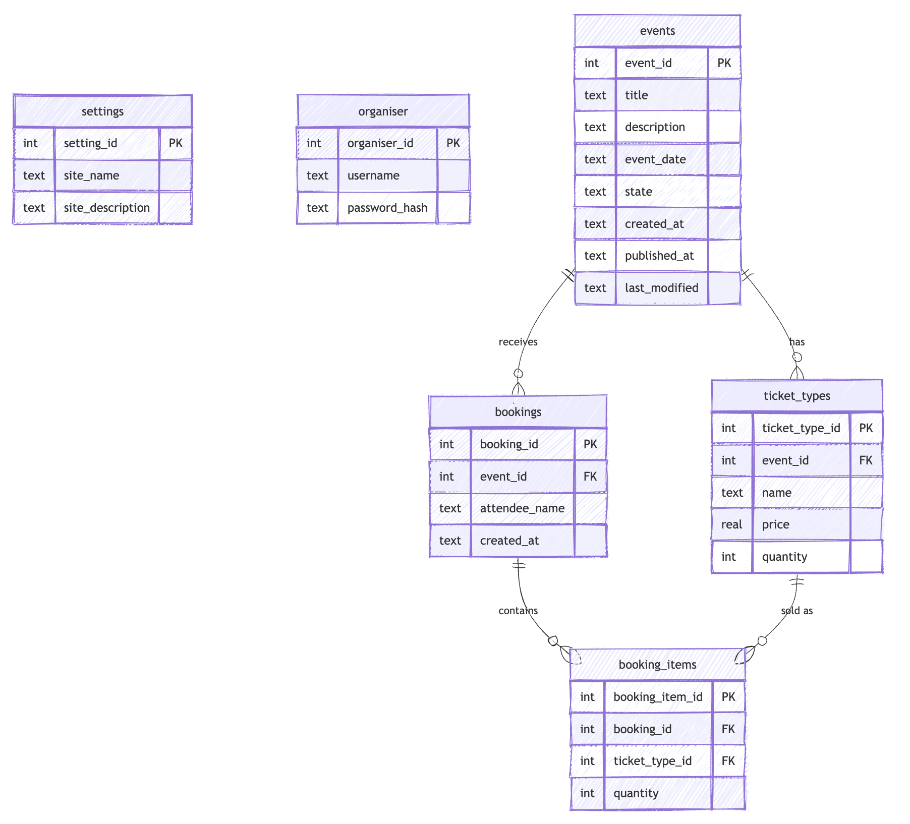

# Event Manager — Report

## 1. Architecture

The application follows a three-tier architecture. The **presentation tier** is
delivered by server-side rendered EJS templates (`views/`) styled with a single
stylesheet (`public/main.css`). The **application tier** is an Express.js server
(`index.js`) with route handlers split by actor (`routes/auth.js`,
`routes/organiser.js`, `routes/attendee.js`). The **data tier** is a single
SQLite database (`database.db`) built from `db_schema.sql`.

The extension elements are highlighted below (authentication + sales dashboard).

## 2. Data model

The data model is normalised. An event has many ticket types; a booking groups
many booking items, each referencing the ticket type purchased. This keeps the
sales aggregation simple and avoids duplicated ticket data. The `organiser`
table is the additional element added by the extension.

Ticket availability is never stored; it is **derived** as
`quantity - SUM(booking_items.quantity)`, so it can never drift out of sync.

## 3. Extension: Organiser authentication + Sales dashboard

### What it does

The base spec leaves the organiser pages open to anyone. The extension adds a
login system so only the organiser can manage events, and a **sales dashboard**
that aggregates bookings into business insight: global totals, a per-event and
per-ticket-type breakdown with remaining capacity, and the most recent bookings.

### How it was implemented

**Authentication.** The `organiser` table stores only a bcrypt hash of the
password (seeded in `db_schema.sql`). On login, the submitted password is checked
against the hash with `bcrypt.compareSync` (`routes/auth.js`, line 72) and, on
success, the organiser id is stored in the session (`routes/auth.js`, line 80).
A `requireAuth` middleware (`routes/auth.js`, lines 21–29) redirects
unauthenticated users to the login page and is applied to every organiser route
via `router.use(requireAuth)` (`routes/organiser.js`, line 16).

**Dashboard.** The dashboard route (`routes/organiser.js`, line 327) runs three
aggregation queries. A totals query joins `booking_items` to `ticket_types` to
compute tickets sold and revenue (`SUM(bi.quantity * tt.price)`). A breakdown
query (line 345) uses `LEFT JOIN ... GROUP BY` so ticket types with no sales
still show, computing `sold`, `remaining` and `revenue` per ticket type. A recent
bookings query (line 393) groups booking items back into bookings for display.

**Safe booking.** Bookings are written inside a transaction
(`routes/attendee.js`, lines 150–151) after re-checking availability
(line 122), so an attendee can never book more tickets than exist.

### Techniques from the course

It uses everything from the taught syllabus — Express routing and middleware,
EJS templating, `express-validator`, and the full range of SQL (INSERT, SELECT,
UPDATE, DELETE) with foreign keys and cascading deletes.

### Beyond the course

Sessions with hashed-password authentication, middleware-based access control,
multi-table aggregation (`JOIN` + `GROUP BY` + `SUM`) for reporting, derived
availability, and transactional writes go beyond the basic CRUD covered in class.
